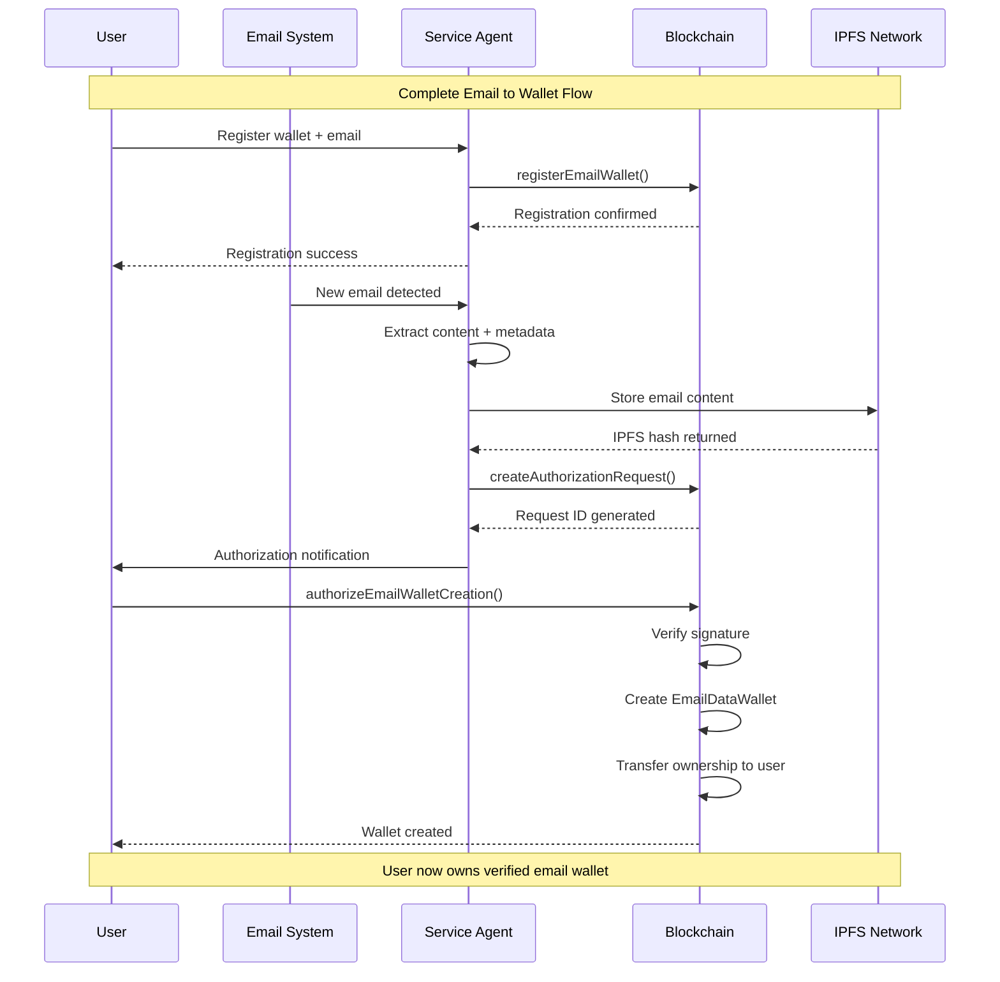
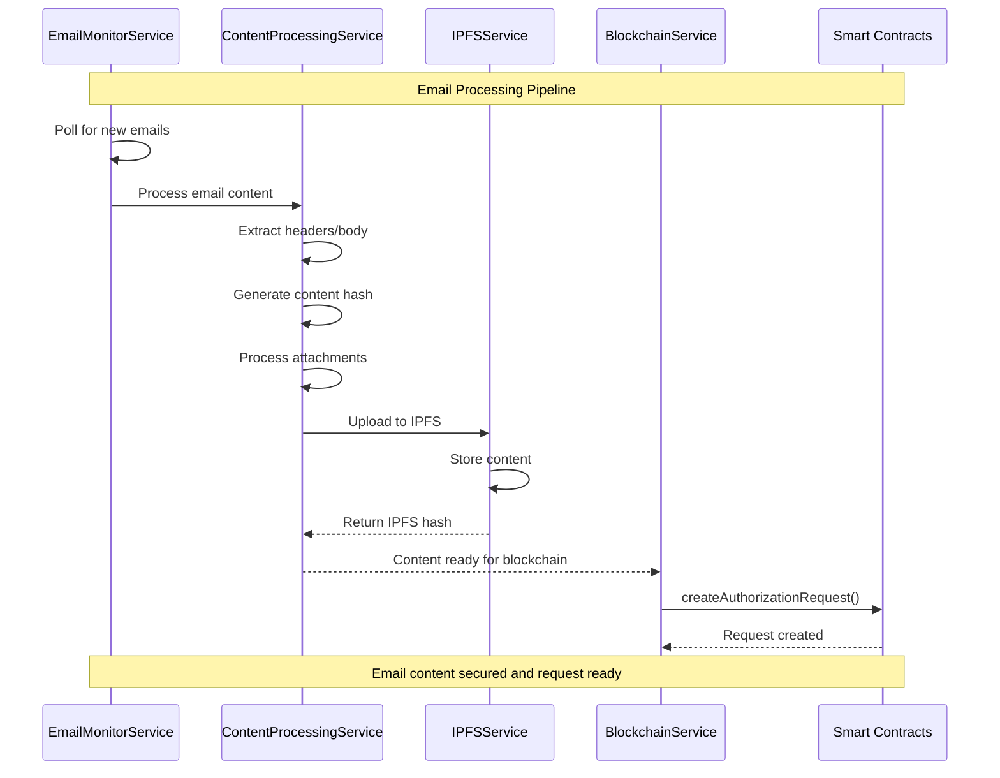
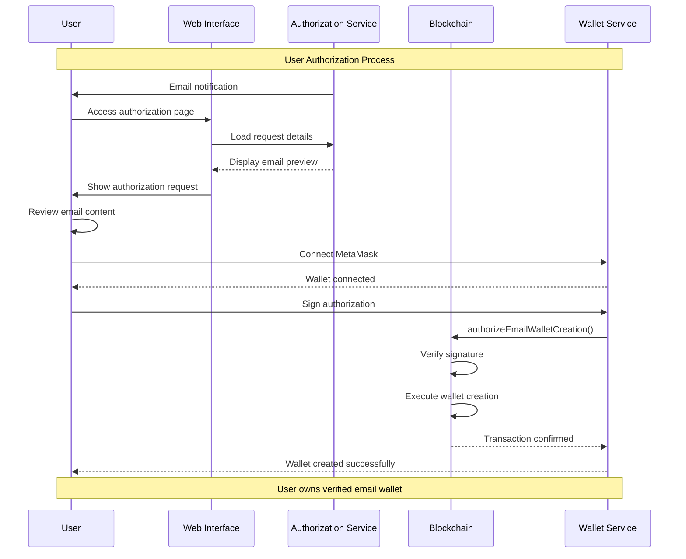
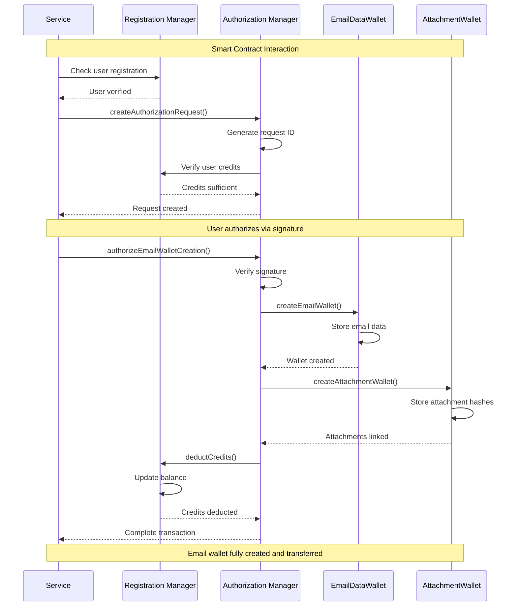
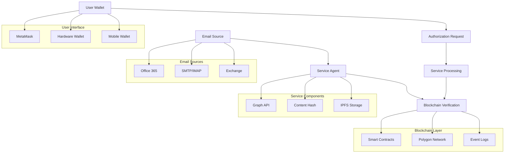

# Email Wallet System - Architecture Documentation

**Version:** 1.0  
**Date:** December 2024  
**Audience:** Architecture Team  
**System:** SKS Rootz Platform - Email Data Wallet Service  

---

## Table of Contents

1. [System Overview](#system-overview)
2. [Component Architecture](#component-architecture)
3. [Blockchain Integration](#blockchain-integration)
4. [UML Interaction Diagrams](#uml-interaction-diagrams)
5. [Security Model](#security-model)
6. [Email Provenance Verification](#email-provenance-verification)
7. [Data Flow Analysis](#data-flow-analysis)
8. [Deployment Architecture](#deployment-architecture)
9. [Appendix A: UML Diagram Source Code](#appendix-a-uml-diagram-source-code)

---

## 1. System Overview

### Purpose
The Email Wallet System transforms email communications into verifiable blockchain DATA_WALLETs, creating immutable provenance records using the "math of ORIGIN" - a comprehensive model that tracks data from source to user-owned digital asset.

### Core Value Proposition
- **Immutable Email Records:** Every email becomes a blockchain-verified digital asset
- **Cryptographic Provenance:** Complete audit trail from email reception to wallet ownership
- **User Ownership:** Recipients control their data wallets with full blockchain verification
- **Anti-Tampering:** Email content integrity protected by cryptographic hashing
- **Compliance Ready:** Built-in audit trails for regulatory requirements

### High-Level Architecture

**[INSERT DIAGRAM 1: System Overview Here]**

The system follows a clear flow from email source through service processing to blockchain verification and user ownership.

---

## 2. Component Architecture

### 2.1 Email Processing Components

#### Email Monitor Service
**Purpose:** Monitors incoming emails and triggers processing pipeline

**Component Structure:**
- **GraphEmailMonitorService (Microsoft Graph API)**
  - OAuth2 Authentication
  - Polling Mechanism (1-minute intervals)
  - Email Content Extraction
  - Security Validation

- **ImapEmailMonitorService (Alternative)**
  - IMAP Connection Management
  - SSL/TLS Security
  - Mailbox Polling

- **Email Processing Pipeline**
  - Content Hash Generation
  - Attachment Processing
  - Metadata Extraction
  - IPFS Upload

**Chain Data Relationship:**
- Email hash stored in EmailDataWallet contract
- IPFS hash recorded for distributed storage
- Timestamp and sender verification on-chain
- Attachment hashes linked to main email record

#### Content Processing Service
**Purpose:** Extracts, validates, and prepares email content for blockchain storage

**Component Structure:**
- **EmailParser**
  - Header Analysis
  - Body Content Extraction
  - Attachment Processing
  - Metadata Collection

- **HashingService**
  - SHA-256 Content Hashing
  - Merkle Tree Construction
  - Attachment Hash Linking
  - Integrity Verification

- **IPFSService**
  - Content Upload
  - Pin Management
  - Retrieval Verification
  - Redundancy Handling

**Chain Data Relationship:**
- Content hash becomes immutable record in smart contract
- IPFS hash enables distributed retrieval
- Merkle tree structure proves attachment integrity
- Metadata stored as structured blockchain events

### 2.2 Blockchain Integration Components

#### Blockchain Service
**Purpose:** Primary interface to Polygon blockchain and smart contracts

**Component Structure:**
- **Contract Management**
  - EmailWalletRegistration (0x71C1...)
  - EmailDataWallet (0x52e...)
  - AttachmentWallet (0x5e0...)
  - AuthorizationManager (0xcC2...)

- **Transaction Management**
  - Gas Estimation
  - Transaction Signing
  - Error Handling
  - Receipt Verification

- **Service Wallet Management**
  - Private Key Security
  - Balance Monitoring
  - Automated Operations
  - Multi-Signature Support

- **Event Monitoring**
  - Contract Event Listening
  - State Change Detection
  - User Notification Triggers
  - Error Recovery

**Chain Data Relationship:**
- Service wallet executes all blockchain operations
- Contract state maintains user registrations and credits
- Transaction hashes provide immutable operation proof
- Event logs create searchable audit trail

#### Smart Contract Architecture

**Smart Contract Ecosystem:**
- **EmailWalletRegistration**
  - User Registration Management
  - Credit System
  - Email-to-Wallet Mapping
  - Access Control

- **EmailDataWallet**
  - Email Content Storage
  - Metadata Management
  - Ownership Transfer
  - Retrieval Functions

- **AttachmentWallet**
  - Attachment Hash Storage
  - File Type Validation
  - Size Tracking
  - Linked Email References

- **AuthorizationManager**
  - User Intent Verification
  - Signature Validation
  - Automated Processing
  - State Coordination

### 2.3 User Management Components

#### Registration Service
**Purpose:** Manages user onboarding and wallet association

**Component Structure:**
- **User Onboarding**
  - Email Verification
  - Wallet Connection
  - Signature Validation
  - Identity Binding

- **Credit Management**
  - Initial Credit Allocation
  - Usage Tracking
  - Billing Integration
  - Refund Processing

- **Access Control**
  - Permission Management
  - Role Assignment
  - Security Policies
  - Audit Logging

**Chain Data Relationship:**
- User wallet address becomes primary identity
- Email addresses linked to wallet on-chain
- Credit balance maintained in smart contract
- Registration timestamp creates permanent record

### 2.4 Security and Infrastructure Components

#### Configuration Management (EPISTERY Pattern)
**Purpose:** Secure configuration and secret management

**Component Structure:**
- **Domain-Aware Configuration**
  - ~/.data-wallet/domain/config.ini
  - Environment Separation
  - Secret Isolation
  - Dynamic Loading

- **Security Features**
  - Private Key Protection
  - API Key Management
  - Certificate Storage
  - Access Logging

- **Service Integration**
  - Multi-Service Configuration
  - Shared Resources
  - Version Management
  - Rollback Capability

---

## 3. Blockchain Integration

### Contract Interaction Patterns

#### Registration Flow
**User Registration Process:**
1. User signs message with wallet
2. Service validates signature
3. Service calls EmailWalletRegistration.registerEmailWallet()
4. Contract creates user record with email mapping
5. Initial credits deposited (60 credits = 0.006 POL)
6. Registration event emitted for tracking

#### Email Processing Flow
**Email to Wallet Process:**
1. Email detected in monitored account
2. Content extracted and hashed
3. IPFS upload for distributed storage
4. Service calls AuthorizationManager.createAuthorizationRequest()
5. User receives notification to authorize
6. User signs authorization via MetaMask
7. Service calls authorizeEmailWalletCreation()
8. Automated wallet creation and ownership transfer

### Data Storage Strategy

#### On-Chain Data (Gas Optimized)
- User wallet addresses and email mappings
- Content hashes (SHA-256)
- IPFS hash references
- Ownership records and transfers
- Credit balances and transactions
- Authorization signatures and timestamps

#### Off-Chain Data (IPFS)
- Full email content
- Attachment files
- Extended metadata
- Search indexes
- Backup copies

---

## 4. UML Interaction Diagrams

### 4.1 System-Level Interaction Diagram
**[INSERT DIAGRAM 2: System Level Interaction Here]**

This diagram shows the complete flow from user registration through email processing to final wallet creation and ownership transfer.

### 4.2 Email Processing Component Interaction
**[INSERT DIAGRAM 3: Email Processing Components Here]**

This diagram illustrates how the email processing components interact to detect, process, and prepare emails for blockchain storage.

### 4.3 User Authorization Flow
**[INSERT DIAGRAM 4: User Authorization Here]**

This diagram shows the user authorization process including MetaMask integration and signature verification.

### 4.4 Blockchain Transaction Flow
**[INSERT DIAGRAM 5: Blockchain Transactions Here]**

This diagram details the smart contract interactions during the email wallet creation process.

---

## 5. Security Model

### 5.1 Identity and Authentication Security

#### Multi-Layer Identity Verification

**Identity Security Stack:**
- **Wallet-Based Identity**
  - Ethereum wallet address as primary ID
  - Private key proves wallet ownership
  - No traditional username/password required
  - Cryptographic signature verification

- **Email Address Binding**
  - Email-to-wallet mapping stored on-chain
  - Signature proves email ownership intent
  - One email per wallet enforcement
  - Immutable binding after registration

- **Service Authentication**
  - Service wallet with contract ownership
  - Multi-signature capability for high-value operations
  - Hardware Security Module (HSM) ready
  - Role-based access control (RBAC)

#### Authentication Flow Security
1. **User Registration:** User signs message containing email and wallet address
2. **Signature Validation:** Service verifies cryptographic signature
3. **Blockchain Recording:** Mapping stored immutably on-chain
4. **Ongoing Verification:** Every operation requires signature proof

### 5.2 Data Integrity and Provenance

#### Content Integrity Protection

**Data Integrity Mechanisms:**
- **Cryptographic Hashing**
  - SHA-256 hash of complete email content
  - Separate hashes for each attachment
  - Merkle tree for multi-attachment emails
  - Hash stored immutably on blockchain

- **IPFS Content Addressing**
  - Content-addressed storage (CAS)
  - Distributed storage across nodes
  - Cryptographic verification of retrieval
  - Redundant storage for availability

- **Blockchain Immutability**
  - Email hash stored in smart contract
  - Timestamp proof of storage
  - Ownership transfer records
  - Complete audit trail

#### Tamper Detection
- **Pre-Storage:** Hash generated before blockchain storage
- **Post-Storage:** Any content change produces different hash
- **Verification:** Compare stored hash with current content hash
- **Proof:** Mathematical impossibility of same hash for different content

### 5.3 Access Control and Authorization

#### Multi-Level Access Control

**Access Control Matrix:**
- **Contract Level**
  - Owner-only functions (service operations)
  - User-only functions (authorization signing)
  - View functions (public data access)
  - Emergency controls (pause/upgrade)

- **Application Level**
  - User wallet verification
  - Email ownership validation
  - Credit balance checking
  - Rate limiting and DOS protection

- **Infrastructure Level**
  - Network access controls
  - API authentication
  - Service-to-service security
  - Database access restrictions

#### Authorization Security Model
1. **Intent Verification:** User must explicitly authorize each email wallet
2. **Signature Verification:** Cryptographic proof of authorization
3. **Non-Repudiation:** Blockchain record prevents denial
4. **Time-Bound:** Authorization requests expire (24 hours)

### 5.4 Privacy and Confidentiality

#### Privacy Protection Mechanisms

**Privacy Architecture:**
- **Data Minimization**
  - Only essential data stored on-chain
  - Full content stored off-chain (IPFS)
  - Metadata selectively disclosed
  - User controls data sharing

- **Encryption Options**
  - Email content encryption before IPFS
  - User-controlled encryption keys
  - Selective disclosure mechanisms
  - Zero-knowledge proof capability

- **Access Controls**
  - User owns wallet and controls access
  - Granular permission system
  - Audit trail of data access
  - Revocation capabilities

### 5.5 Network and Infrastructure Security

#### Security Infrastructure

**Infrastructure Security:**
- **Blockchain Security**
  - Polygon network security model
  - Smart contract auditing
  - Gas optimization for DOS resistance
  - Upgrade mechanisms with governance

- **Service Security**
  - HTTPS/TLS for all communications
  - API rate limiting and throttling
  - Input validation and sanitization
  - Error handling without information leakage

- **Storage Security**
  - IPFS content addressing security
  - Distributed storage redundancy
  - Backup and recovery procedures
  - Data retention policies

- **Operational Security**
  - Monitoring and alerting systems
  - Incident response procedures
  - Security audit logging
  - Vulnerability management

---

## 6. Email Provenance Verification

### What We Can Prove About an Email Wallet

#### 6.1 Content Integrity Proofs

**Cryptographic Content Verification**

**Provable Facts:**
✓ Content has not been modified since wallet creation  
✓ Exact timestamp of email processing  
✓ Original email headers and metadata  
✓ Complete attachment inventory and integrity  
✓ IPFS storage location and retrieval hash  

**Mathematical Proof Structure:**
- **Hash Function Property:** SHA-256(content) → unique 256-bit fingerprint
- **Collision Resistance:** Computationally impossible to find different content with same hash
- **Blockchain Immutability:** Hash stored permanently with timestamp
- **Verification Process:** Re-hash current content, compare with stored hash

#### 6.2 Ownership and Authorization Proofs

**Wallet Ownership Chain**

**Ownership Provenance:**
✓ Original email recipient wallet address  
✓ Cryptographic signature proving authorization intent  
✓ Blockchain transaction showing ownership transfer  
✓ Current owner wallet address  
✓ Complete ownership history with timestamps  

**Authorization Verification:**
- **Signature Verification:** Proves wallet owner authorized wallet creation
- **Message Authentication:** Specific authorization message signed
- **Non-Repudiation:** Signer cannot deny authorization
- **Timestamp Proof:** Exact time of authorization recorded

#### 6.3 Service Processing Proofs

**Email Processing Verification**

**Service Operation Proofs:**
✓ Email received by monitored account (Microsoft Graph API logs)  
✓ Content extraction performed by verified service  
✓ Hash generation process auditable  
✓ IPFS upload transaction recorded  
✓ Blockchain transaction initiated by service wallet  

**Service Integrity Chain:**
- **Service Identity:** Known service wallet address with proven ownership
- **Operation Logging:** Complete audit trail of service operations
- **Transaction Verification:** All blockchain operations traceable
- **Process Transparency:** Open source processing algorithms

#### 6.4 Temporal Proofs

**Time-Based Verification**

**Temporal Provenance:**
✓ Email reception timestamp (email headers)  
✓ Processing timestamp (service logs)  
✓ IPFS upload timestamp  
✓ Blockchain transaction timestamp  
✓ Authorization timestamp (user signature)  

**Timeline Integrity:**
- **Email Headers:** Original timestamp from email system
- **Service Processing:** Logged processing time
- **Blockchain Time:** Block timestamp (immutable)
- **Sequence Verification:** Logical order of operations

### What We Cannot Prove

#### Limitations and Scope

**Cannot Prove:**
✗ Email authenticity before reaching monitored account  
✗ Sender identity verification (requires separate email authentication)  
✗ Email content truthfulness or accuracy  
✗ Compliance with regulations in sender's jurisdiction  
✗ Original composition device or location  

**Email System Dependencies:**
- **Email Authentication:** Relies on email provider's authentication (SPF, DKIM, DMARC)
- **Sender Verification:** Outside scope - email spoofing possible
- **Content Truthfulness:** System verifies integrity, not accuracy
- **Jurisdictional Compliance:** Cannot verify sender's legal compliance

### Verification API

#### Proof Generation Endpoints

```typescript
// Email Wallet Verification API
interface EmailWalletProof {
  walletId: string;
  contentHash: string;
  ipfsHash: string;
  ownerAddress: string;
  creationTimestamp: number;
  blockNumber: number;
  transactionHash: string;
  
  // Verification Methods
  verifyContentIntegrity(): boolean;
  verifyOwnership(address: string): boolean;
  verifyTimestamp(): boolean;
  generateProofPackage(): ProofPackage;
}

// Usage Example
const proof = await emailWalletService.getProof(walletId);
const isValid = proof.verifyContentIntegrity();
const proofPackage = proof.generateProofPackage();
```

#### Third-Party Verification

**Independent Verification Process:**
1. **Retrieve Wallet Data:** Query blockchain for email wallet record
2. **Download Content:** Fetch email content from IPFS using stored hash
3. **Re-compute Hash:** Generate SHA-256 hash of retrieved content
4. **Compare Hashes:** Verify computed hash matches blockchain record
5. **Verify Signatures:** Validate all cryptographic signatures
6. **Check Timestamps:** Verify temporal consistency

**Verification Tools:**
- Blockchain explorer integration
- IPFS content verification
- Cryptographic signature validation
- Automated verification scripts

---

## 7. Data Flow Analysis

### 7.1 Registration Data Flow

**Registration Process:**
```
User Wallet → Signature Generation → Service Validation → Blockchain Storage
     ↓              ↓                     ↓                    ↓
Email Address → Message Signing → Cryptographic Proof → Immutable Record
     ↓              ↓                     ↓                    ↓
User Intent → Authorization → Service Processing → Chain Confirmation
```

**Data Transformations:**
1. **Input:** User email + wallet address + signature
2. **Validation:** Cryptographic signature verification
3. **Processing:** Email-to-wallet mapping creation
4. **Storage:** Blockchain transaction with gas payment
5. **Output:** Registration confirmation + credit allocation

### 7.2 Email Processing Data Flow

**Email Ingestion Flow:**
```
Email Source → Service Detection → Content Extraction → Hash Generation
     ↓               ↓                    ↓                   ↓
Raw Email → Structured Data → Content Hash → IPFS Storage
     ↓               ↓                    ↓                   ↓
Metadata → Processing Queue → Authorization Request → User Notification
```

**Critical Data Points:**
- **Content Hash:** Immutable fingerprint of email content
- **IPFS Hash:** Distributed storage address
- **Metadata:** Structured email information
- **Authorization Token:** User-specific authorization identifier

### 7.3 Authorization Data Flow

**Authorization Process:**
```
User Intent → MetaMask Signature → Blockchain Validation → Automated Processing
     ↓              ↓                      ↓                       ↓
Authorization → Cryptographic Proof → Smart Contract → Wallet Creation
     ↓              ↓                      ↓                       ↓
User Approval → Signature Verification → Credit Deduction → Ownership Transfer
```

**State Transitions:**
1. **Pending:** Authorization request created
2. **Signed:** User provides cryptographic signature
3. **Verified:** Smart contract validates signature
4. **Processed:** Wallet created and ownership transferred
5. **Complete:** User owns verified email wallet

---

## 8. Deployment Architecture

### Production Infrastructure

**Production Deployment:**
- **Frontend Layer**
  - React.js Web Application
  - MetaMask Integration
  - Authorization Interface
  - Wallet Management Dashboard

- **API Layer**
  - .NET 8 Web API
  - RESTful Endpoints
  - Authentication Middleware
  - Rate Limiting

- **Service Layer**
  - Email Monitor Service
  - Blockchain Service
  - Content Processing Service
  - Notification Service

- **Storage Layer**
  - PostgreSQL (User Data)
  - IPFS (Email Content)
  - Blockchain (Verification)
  - Redis (Caching)

- **Infrastructure Layer**
  - Docker Containers
  - Kubernetes Orchestration
  - Load Balancers
  - Monitoring Stack

### Security Deployment Considerations

**Network Security:**
- TLS 1.3 for all communications
- API Gateway with rate limiting
- VPC isolation for sensitive services
- WAF protection for web applications

**Data Security:**
- Encryption at rest for database
- Encrypted IPFS storage option
- Secure key management (Azure Key Vault)
- Regular security audits

**Operational Security:**
- Container security scanning
- Vulnerability management
- Incident response procedures
- Backup and disaster recovery

---

## 9. Conclusion

The Email Wallet System provides a comprehensive solution for transforming email communications into verifiable blockchain assets. The architecture ensures:

- **Cryptographic Integrity:** Mathematical proof of content authenticity
- **Immutable Provenance:** Complete audit trail from email to wallet
- **User Ownership:** Blockchain-verified ownership and control
- **Scalable Security:** Multi-layer security model with defense in depth
- **Regulatory Compliance:** Built-in audit trails and verification mechanisms

The system's security model provides strong guarantees about email content integrity, ownership provenance, and temporal sequencing, while clearly documenting the limitations and scope of verification capabilities.

For architecture teams, this document provides the foundation for understanding component relationships, security implications, and integration requirements for the Email Wallet system.

---

## Appendix A: UML Diagram Source Code

### A.1 System-Level Interaction Diagram



### A.2 Email Processing Component Interaction



### A.3 User Authorization Flow



### A.4 Blockchain Transaction Flow



### A.5 High-Level Architecture Diagram



---

**End of Document**